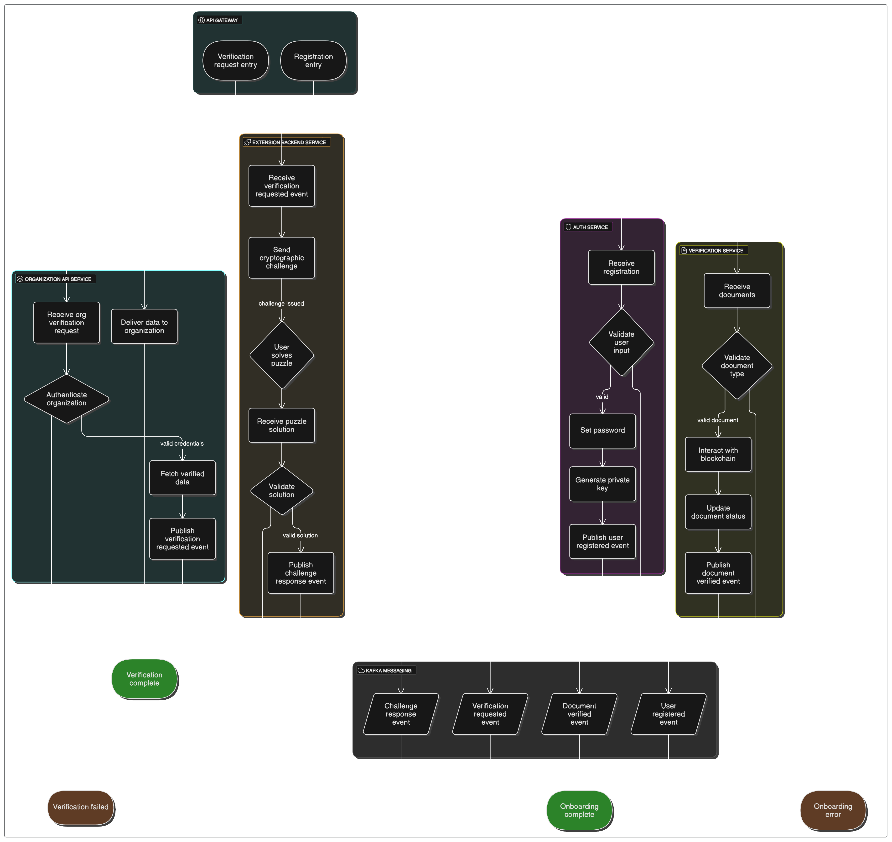

# Null Card — Verify Once, Trusted Forever

## Overview

**Null Card** is a next-generation decentralized KYC platform that unifies all verified Indian identity documents into a single, transparent, and blockchain-backed digital identity. Leveraging Web3 technology and smart contracts deployed on Polygon PoS, Null Card eliminates the need for third-party intermediaries by enabling anyone to verify user documents securely and publicly, while preserving user privacy and control.

---

## Objectives

- **Unified Document Verification:** Combine all major Indian government-verified documents (Aadhaar, Passport, PAN, Voter ID, Ration Card, Driving License) into one comprehensive digital identity — the “Null Card.”
- **Decentralized Trust:** Use blockchain and Web3 to provide transparent, tamper-proof verification accessible to anyone without relying on centralized authorities.
- **Zero Intermediaries:** The name “Null Card” symbolizes eliminating third-party gatekeepers, providing a “null” or zero-trust reliance on external verifiers.
- **User-Controlled Authentication:** Users authenticate themselves via a browser extension that uses cryptographic challenge-response puzzles based on their on-chain public keys and a password set at registration.
- **Organization Access:** Authorized organizations receive a public key to securely access verified user data through a REST API, enabling streamlined KYC and compliance workflows.
- **Open Verification:** Anyone can view verified documents on-chain, fostering transparency and trust in identity verification.

---

## System Design & Flowcharts

Below are the system design diagrams and flowcharts for the Null Card platform:

### High-Level Architecture & Workflow


---

### Microservices Flow & Event Handling



---

*These diagrams illustrate the interactions between microservices, the blockchain layer, API gateway, extension backend, and the event-driven communication using Kafka. They also detail the user registration, document verification, organization verification request, and cryptographic challenge-response flows.*

---

## Features

- User registration and authentication with password and private key management.
- Document verification and status management on Polygon PoS blockchain.
- REST API for organizations to query verified user data securely.
- Browser extension for user authentication and cryptographic proof of identity.
- Event-driven microservices architecture with Apache Kafka for scalable communication.
- Containerized deployment on AWS with load balancing, auto scaling, and CI/CD pipelines.
- Comprehensive monitoring, logging, and distributed tracing for observability.

---

## Architecture

- **Microservices:**
  - Auth Service
  - Verification Service
  - Organization API Service
  - Extension Backend Service
  - API Gateway
- **Blockchain:** Polygon PoS smart contract managing documents and user status.
- **Messaging:** Apache Kafka for asynchronous event streaming.
- **Deployment:** Docker containers on AWS EC2 with load balancers and auto scaling.

---

## Getting Started

### Clone the Repository

```
git clone https://github.com/PurpleDrip/1-Card
cd 1-Card
```

### Setup Environment Variables

Each microservice requires configuration, for example:

```
PORT=3000
DATABASE_URL=your_database_connection_string
KAFKA_BROKER=your_kafka_broker_url
POLYGON_RPC_URL=https://polygon-rpc.com/
SMART_CONTRACT_ADDRESS=your_contract_address
JWT_SECRET=your_jwt_secret
```

### Running Locally

Use Docker Compose to start all services and dependencies:

```
docker-compose up --build
```

### Deployment

- Containerize microservices with Docker.
- Push images to AWS ECR.
- Deploy on AWS EC2 or ECS/Fargate.
- Configure Application Load Balancer and Auto Scaling.
- Automate deployments with CI/CD pipelines (GitHub Actions, AWS CodePipeline).

---

## API Documentation

Available via Swagger/OpenAPI endpoints per microservice:

- Auth Service: `/auth/swagger`
- Verification Service: `/verification/swagger`
- Organization API Service: `/organization/swagger`
- Extension Backend Service: `/extension/swagger`

---

## Contributing

Contributions, issues, and feature requests are welcome! Please open an issue or submit a pull request on GitHub.

---

## License

This project is licensed under the MIT License.

---

## Contact

- Maintainer: Gurupreeth
- Email: gurupreethnagesha@gmail.com
- GitHub: [PurpleDrip](https://github.com/PurpleDrip)

---

## Acknowledgements

- OpenZeppelin Contracts  
- Polygon PoS Network  
- Apache Kafka  
- AWS Cloud Services  
- Express.js Community  
